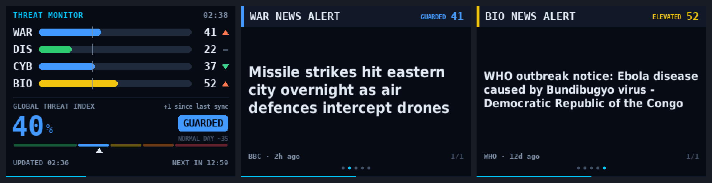

# Threat Monitor

Created and maintained by **Oliver Kuy** ([@kuydigital](https://github.com/kuydigital)).

A small dashboard that turns public news and alert feeds into a **Global Threat
Index** plus four scores: **WAR**, **DIS** (natural disasters), **CYB** (cyber)
and **BIO** (outbreaks), with the latest headline for each. It runs as a
**Windows 10/11 screensaver**, a **macOS screensaver**, on a Raspberry Pi with a
tiny 320×240 screen, or in a window on any desktop.



## Download

| Installer | For | Download |
|---|---|---|
| **Windows screensaver** | Windows 10 and 11 | [](https://github.com/kuydigital/threat_monitor/releases/latest/download/ThreatMonitor-Windows.zip) |
| **macOS screensaver** | macOS 12 Monterey or later, Apple silicon and Intel | [](https://github.com/kuydigital/threat_monitor/releases/latest/download/ThreatMonitor-macOS.zip) |

Both are free and need nothing else installed. On the
[Releases](https://github.com/kuydigital/threat_monitor/releases) page they are
labeled **Windows screensaver (ZIP)** and **macOS screensaver (ZIP)**.

## Windows screensaver

1. Download the **Windows screensaver (ZIP)** and unzip it.
2. Double-click **install.bat**. If Windows shows *"Windows protected your PC"*,
   click *More info → Run anyway* (shown for downloaded programs that aren't
   signed by a company).
3. Screen Saver Settings opens with **ThreatMonitor** selected. Pick a wait
   time and click **OK**.

To remove it, run `uninstall_screensaver.bat`.

**Building it yourself:** double-click `build_screensaver.bat` in a copy of
this repository. It builds the screensaver and installs it. If Python isn't
installed, it offers to install Python 3.13 for your user account first (no
admin rights needed). The finished screensaver carries its own copy of
Python, so Python is only needed for building.

## macOS screensaver

1. Download the **macOS screensaver (ZIP)** and open it.
2. Double-click **Threat Monitor.saver** and click **Install**.
3. If macOS says it can't verify *Threat Monitor.saver* (when installing or
   when you first pick it), click *Done*, open **System Settings → Privacy &
   Security**, scroll down and click **Open Anyway**. macOS asks this once for
   free apps that aren't registered with Apple.
4. In **System Settings → Screen Saver**, pick **Threat Monitor**.

Or install it from Terminal, with no security prompts:

```bash
curl -fsSL https://raw.githubusercontent.com/kuydigital/threat_monitor/main/mac/install.sh | bash
```

To remove it, Control-click Threat Monitor in the Screen Saver settings and
choose *Delete*, or delete it from `~/Library/Screen Savers`. After installing
a newer version, log out and back in if the old one still shows.

The Mac screensaver is a native Swift program (in [`mac/`](mac)) with the same
sources, scoring and screens as the Python version; its tests check that both
give identical results on the same news. **Building it yourself:** run
`mac/build.sh` on a Mac with Xcode or the Command Line Tools
(`xcode-select --install`), then double-click `mac/build/Threat Monitor.saver`.

## Raspberry Pi / Linux / macOS (Python)

```bash
sudo apt install python3-pygame python3-requests   # Raspberry Pi OS / Debian
# or: pip install -r requirements.txt

python3 threat_monitor.py                     # full screen
python3 threat_monitor.py --windowed 320x240  # in a window
python3 threat_monitor.py --demo              # sample data, no network
python3 threat_monitor.py --check             # test every source, explain the scores
```

Keys: **Esc/Q** quit · **→ / Space / tap** next screen · **←** previous ·
**R** update now · **F** switch between window and full screen.

## How the scores work

- **WAR, CYB, BIO** measure how much of the general news is about each
  threat, compared with that source's own usual level over the last 30 days.
  An ordinary day reads about **35 (GUARDED)**, twice the usual amount about
  58, three times about 73. The first day uses starting estimates while the
  monitor learns what "usual" looks like (shown as *LEARNING n/24h*).
- **DIS** uses official GDACS alert levels (USGS earthquake alerts as a backup):
  routine green alerts count a little, orange and red alerts count fully.
- **Global Threat Index** combines the four, giving more weight to whichever
  is highest.
- Levels: LOW < 30 · GUARDED 30–44 · ELEVATED 45–59 · HIGH 60–74 · SEVERE 75+.

It measures how much is being *reported*, not real-world danger, so treat it
as a news-intensity indicator rather than a forecast.

## Data sources

[BBC News](https://www.bbc.co.uk/news), [Al Jazeera](https://www.aljazeera.com),
[NPR](https://www.npr.org) and [Google News](https://news.google.com) RSS feeds;
[GDACS](https://www.gdacs.org) disaster alerts (© European Union, CC BY 4.0);
[USGS](https://earthquake.usgs.gov) earthquake feed;
[CISA Known Exploited Vulnerabilities](https://www.cisa.gov/known-exploited-vulnerabilities-catalog);
[WHO Disease Outbreak News](https://www.who.int/emergencies/disease-outbreak-news).
Headlines belong to their publishers and are shown with their source.

## Troubleshooting

- **Windows:** the log is `%APPDATA%\ThreatMonitor\screensaver.log`. If
  ThreatMonitor is missing from the Screen Saver list, run
  `register_screensaver.bat`.
- **macOS:** the log is `screensaver.log` in
  `~/Library/Containers/com.apple.ScreenSaver.Engine.legacyScreenSaver/Data/Library/Application Support/ThreatMonitor`.
- **Pi / Linux:** `threat_monitor.log` next to the script records every update
  and any source that failed. `python3 threat_monitor.py --check` shows what
  each source returned.

## Publishing a new release (maintainers)

On GitHub: **Releases → Draft a new release**, create a tag such as `v1.1.0`,
and click **Publish release**. Or from a terminal:

```bash
git tag v1.1.0
git push origin v1.1.0
```

Either way, GitHub Actions builds both screensavers (Windows and macOS), tests
them, and attaches **Windows screensaver (ZIP)** and **macOS screensaver (ZIP)**
to the release a few minutes later (see `.github/workflows/release.yml`). The
download buttons above always point to the newest release. *Actions → Build
screensavers → Run workflow* runs the same builds and tests without
publishing anything.

## License

Released under the [MIT License](LICENSE). Copyright (c) 2026 Oliver Kuy.
